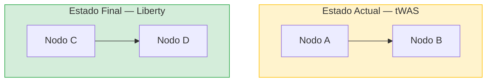

# Java Mod Workshop — Pautas de Diseño y Contenido

Guía completa de diseño, contenido y desarrollo del Workshop de Modernización Java (tWAS → WebSphere Liberty con IBM AMA).

---

## 1. Arquitectura del Proyecto

### Repositorio

```
java-mod-workshop/
├── docs/                          # Contenido del workshop
│   ├── index.md / index.en.md    # Portada (ES / EN)
│   ├── lab0/ … lab6/             # Labs individuales
│   │   ├── index.md              # Versión española
│   │   ├── index.en.md           # Versión inglesa
│   │   └── img/                  # Capturas de pantalla del lab
│   ├── styles/
│   │   ├── custom.css            # IBM Carbon palette + estilos
│   │   └── override-print.css    # Estilos de impresión
│   └── _static/
│       └── hide-toc-nav.js       # JS de apoyo
├── pedjasapp-twas/               # App legado (EAR tWAS)
├── pedjasapp-liberty/            # App modernizada (WAR Liberty)
│   ├── Dockerfile
│   ├── server.xml
│   └── src/
├── k8s/                          # Manifiestos Kubernetes / OpenShift
├── scripts/                      # Suite de checks Playwright
│   ├── _shared.js
│   ├── check-docs.js
│   ├── check-app.js
│   ├── capture-lab2-screenshots.js
│   ├── capture-app-screenshots.js
│   └── run-all.js
├── mkdocs.yml
├── package.json
└── .github/workflows/deploy.yml
```

### Stack técnico

| Componente | Tecnología |
|-----------|-----------|
| Documentación | MkDocs Material + mkdocs-static-i18n |
| Idiomas | Español (default) + English (`/en/`) |
| App servidor destino | WebSphere Liberty 26.0.0.9 |
| Jakarta EE | Jakarta EE 10 / MicroProfile 6.1 |
| Base de datos | PostgreSQL 16 |
| Contenerización | Podman 4.x (no Docker) |
| Tests/capturas | Playwright (Node.js ESM, `"type": "module"`) |
| CI/CD | GitHub Actions → GitHub Pages |

---

## 2. Configuración MkDocs (`mkdocs.yml`)

### Tema y extensiones obligatorias

```yaml
theme:
  name: material
  features:
    - navigation.tracking
    - navigation.sections
    - navigation.indexes
    - content.code.annotate
    - content.code.copy
    - content.code.select
    - navigation.footer
  palette:
    scheme: default

plugins:
  - search
  - glightbox
  - i18n:
      languages:
        - locale: es
          name: Español
          default: true
          build: true
        - locale: en
          name: English
          build: true
          nav: [...]   # espeja la nav principal con paths .en.md

markdown_extensions:
  - admonition
  - pymdownx.details
  - pymdownx.highlight:
      anchor_linenums: true
  - pymdownx.superfences:
      custom_fences:
        - name: mermaid
          class: mermaid
          format: !!python/name:pymdownx.superfences.fence_code_format
  - pymdownx.keys
  - attr_list
  - md_in_html
  - tables
  - toc:
      permalink: true

extra_css:
  - styles/override-print.css
  - styles/custom.css
```

**Regla**: `mkdocs build --strict` debe pasar sin warnings. Verificar siempre antes de hacer commit.

---

## 3. Paleta de Colores IBM Carbon

Variables CSS definidas en `docs/styles/custom.css`:

| Variable | Valor hex | Uso |
|---------|-----------|-----|
| `--ibm-blue-60` | `#0043ce` | Header, nav title, h3 |
| `--ibm-blue-50` | `#0f62fe` | Nav link activo, h1 border, tabla th, badges |
| `--ibm-blue-40` | `#4589ff` | h2 border-left |
| `--ibm-gray-10` | `#f4f4f4` | Fondo code inline, filas pares de tabla |
| `--ibm-gray-20` | `#e0e0e0` | Bordes code/pre |
| `--ibm-gray-90` | `#262626` | Color de texto h1/h2 |
| `--ibm-teal-50` | `#009d9a` | Admonition tip icon |
| `--ibm-green-50` | `#198038` | Éxito |
| `--ibm-red-50` | `#da1e28` | Danger/error |
| `--ibm-yellow-30` | `#f1c21b` | Warning icon |

### Reglas de estilo clave

- **Header**: `background-color: var(--ibm-blue-60)`
- **h1**: `border-bottom: 3px solid var(--ibm-blue-50)`
- **h2**: `border-left: 4px solid var(--ibm-blue-40); padding-left: 0.6em`
- **h3**: `color: var(--ibm-blue-60)`
- **Tablas**: cabecera azul `--ibm-blue-60` + texto blanco; filas pares `--ibm-gray-10`
- **Contenido**: `max-width: 900px`

---

## 4. Estructura Obligatoria de Cada Lab

Todo lab **español** sigue exactamente esta plantilla:

```markdown
# Lab N — Título del Lab

---

## Objetivo del Lab

[Párrafo de 2-4 frases describiendo qué hará el participante y qué aprenderá.]

!!! tip "⏱ Duración estimada: XX–YY minutos"
    [Descripción de qué cubre: pasos principales y qué puede tomar más tiempo.]

---

## Sección 1

[Contenido]

---

## Resumen del Lab N

!!! success "Completado"
    En este lab has:

    - [Logro 1]
    - [Logro 2]
    - [Logro 3]

---

## Siguiente Paso

Continúa con el **[Lab N+1 — Título](../labN+1/index.md)**, donde [descripción breve].
```

El lab **inglés** (`index.en.md`) sigue la misma estructura con texto traducido:
- "Objetivo del Lab" → "Lab Objective"
- "Duración estimada" → "Estimated duration"
- "XX minutos" → "XX minutes"
- "Completado" → "Completed"
- "Siguiente Paso" → "Next Step"

---

## 5. Tiempos Estimados por Lab

| Lab | Duración ES | Duración EN | Descripción del tip |
|-----|------------|------------|---------------------|
| Lab 0 | 20–30 minutos | 20–30 minutes | Verificación de herramientas y compilación inicial |
| Lab 1 | 30–45 minutos | 30–45 minutes | Incluye pull imagen tWAS (~1,5 GB) |
| Lab 2 | 30–45 minutos | 30–45 minutes | Incluye instalación AMA (primera vez) |
| Lab 3 | 90–120 minutos | 90–120 minutes | Lab más extenso: 6 cambios de código |
| Lab 3B | 20–40 minutos | 20–40 minutes | Alternativa al Lab 3 Manual |
| Lab 4 | 30–45 minutos | 30–45 minutes | Build imagen + primer arranque |
| Lab 5 | 20–30 minutos | 20–30 minutes | Checklist + endpoints MicroProfile |
| Lab 6 | 45–60 minutos | 45–60 minutes | Lab opcional avanzado (clúster K8s) |

**Total workshop (Labs 0–5)**: ~4–5 horas.

La portada (`index.md` e `index.en.md`) incluye ambas cosas:
1. Columna **⏱ Duración** en la tabla de navegación principal.
2. El mismo desglose en la tabla de **Duración Estimada por Lab** del Lab 0.

---

## 6. Admonitions — Tipos y Uso

```markdown
# Duración (obligatorio en cada lab, justo tras el Objetivo)
!!! tip "⏱ Duración estimada: XX–YY minutos"
    Descripción de lo que cubre.

# Prerrequisito / aviso importante
!!! warning "Antes de comenzar"
    Lista de requisitos.

# Mac Apple Silicon (en labs con imágenes x86)
!!! warning "Mac Apple Silicon (ARM64)"
    Nota sobre --platform linux/amd64.

# Nota informativa
!!! note "Nombre de la nota"
    Texto explicativo.

# Objetivo de aprendizaje (Lab 0)
!!! abstract "Objetivos de Aprendizaje"
    Lista de verbos de aprendizaje.

# Completado (cierre de lab)
!!! success "Completado"
    Resumen de logros del lab.

# Tip técnico
!!! tip "Nombre del tip"
    Consejo práctico.

# Info técnica colateral
!!! info "Nombre"
    Explicación de contexto.

# Peligro / dato crítico
!!! danger "Nombre"
    Advertencia bloqueante.
```

---

## 7. Tablas — Formato Estándar

### Tabla de navegación (portada)

```markdown
| Lab | Módulo | Lo que harás | ⏱ Duración |
|-----|--------|-------------|------------|
| [**Lab 0**](lab0/index.md) | [**Requisitos Previos**](lab0/index.md) | Descripción | 20–30 min |
```

### Tabla de herramientas

```markdown
| Herramienta | Versión Mínima | Propósito | Enlace de Descarga |
|-------------|---------------|-----------|-------------------|
| Java JDK | 17 (LTS) | Compilar código Java | [Adoptium](https://adoptium.net/) |
```

### Tabla de reglas AMA (Lab 2)

```markdown
| Regla AMA | Severidad | Resultados | Categoría |
|-----------|-----------|------------|-----------|
| CR-001 — Descripción | 🔴 Crítico | 11 | Jakarta EE 9 |
| WA-001 — Descripción | 🟡 Advertencia | 1 | WebSphere traditional to Liberty |
| IN-001 — Descripción | 🔵 Informativo | 4 | Cloud connectivity |
```

---

## 8. Bloques de Código

Usar siempre con sintaxis y, si aplica, título:

```markdown
# Con lenguaje y título
```java title="ruta/al/Fichero.java"
public class Ejemplo { }
```

# Solo con lenguaje
```bash
podman run -d --name pedjasapp-liberty ...
```

# Bloque de texto plano (árboles de directorios, output de comandos)
```
pedjasapp-liberty/
├── pom.xml
└── server.xml
```
```

**Reglas**:
- Bloques de código `bash` para todos los comandos del shell.
- Bloques `java` para código Java.
- Bloques `xml` para `server.xml`, `pom.xml`, descriptores.
- Bloques `yaml` para Kubernetes, Docker Compose.
- Bloques `dockerfile` para Dockerfiles.
- Siempre añadir comentario `# Salida esperada:` en el bloque siguiente cuando sea relevante.
- Comandos de Podman (no Docker).

---

## 9. Diagramas Mermaid

Se usan en la portada, Lab 0 y Lab 6. Patrón de colores:

```markdown

```

Paleta de estilos de subgraph:
- **Estado legacy / AS-IS**: `fill:#fff3cd,stroke:#ffc107` (amarillo)
- **Estado objetivo / TO-BE**: `fill:#d4edda,stroke:#28a745` (verde)

---

## 10. Imágenes

- Guardar en `docs/labN/img/` con naming secuencial: `NN-nombre-descriptivo.png`.
- Insertar con caption descriptivo:
  ```markdown
  
  ```
- Ancho viewport de captura: 1440×900 px.
- Formato PNG, comprimido.
- Las capturas de AMA se generan con `node scripts/capture-lab2-screenshots.js`.
- Las capturas de la app Liberty se generan con `node scripts/capture-app-screenshots.js`.

---

## 11. Convenciones de Nomenclatura

| Elemento | Convención | Ejemplo |
|---------|-----------|---------|
| Ficheros de lab | `index.md` / `index.en.md` | `docs/lab3/index.md` |
| Directorio de lab | `labN` o `labNb` | `lab3b/` |
| Imágenes | `NN-nombre-en-kebab.png` | `12-rule-detail-expanded.png` |
| Scripts Playwright | `check-*.js`, `capture-*.js`, `run-*.js` | `check-docs.js` |
| Skills de Bob | kebab-case, minúsculas | `java-mod-workshop` |

---

## 12. Idiomas — Reglas de Paridad ES/EN

Cada fichero `index.md` debe tener su par `index.en.md` con:
- **Mismo número de secciones** en el mismo orden.
- **Mismo número de bloques de código** con el mismo contenido técnico.
- **Mismas tablas** con el mismo número de filas.
- **Mismos admonitions** (tipo, número y posición equivalente).
- **Mismos tiempos estimados** (mismos rangos numéricos).
- **Textos técnicos sin traducir**: nombres de comandos, variables, rutas, configuración.

Términos de traducción fijos:

| Español | English |
|---------|---------|
| Objetivo del Lab | Lab Objective |
| Duración estimada | Estimated duration |
| minutos | minutes |
| Completado | Completed |
| Siguiente Paso | Next Step |
| Resolución de Problemas | Troubleshooting |
| Salida esperada | Expected output |

---

## 13. Datos Técnicos del Entorno

| Parámetro | Valor |
|-----------|-------|
| Liberty port (contenedor) | 9081 (mapeado desde 9080 interno) |
| PostgreSQL port | 5432 |
| AMA GUI | https://localhost/ |
| AMA API REST | https://localhost:2220/lands_advisor/advisor/v2 |
| MkDocs dev server | http://127.0.0.1:8001/java-mod-workshop/ |
| Liberty context root | `/pedjasapp` |
| App credentials | `admin` / `admin123` |
| DB credentials | user=`pedjas`, password=`pedjas123`, db=`pedjasapp` |
| DB host (desde contenedor) | `host.containers.internal` |
| Imagen tWAS | `icr.io/appcafe/websphere-traditional:9.0.5.29` |
| Liberty version | 26.0.0.9 |
| Jakarta EE | 10.0 |
| MicroProfile | 6.1 |
| Java | 17 LTS (compilación) / 21 (objetivo K8s) |

### Variables de entorno del contenedor Liberty

```bash
podman run -d \
  --name pedjasapp-liberty \
  -p 9081:9080 \
  -e PEDJASAPP_DB_HOST=host.containers.internal \
  -e PEDJASAPP_DB_PORT=5432 \
  -e PEDJASAPP_DB_NAME=pedjasapp \
  -e PEDJASAPP_DB_USER=pedjas \
  -e PEDJASAPP_DB_PASSWORD=pedjas123 \
  localhost/pedjasapp-liberty:1.0
```

### Rebuild completo del contenedor Liberty

```bash
cd pedjasapp-liberty
mvn clean package -DskipTests -q
podman build -t localhost/pedjasapp-liberty:1.0 . -q
podman stop pedjasapp-liberty && podman rm pedjasapp-liberty
podman run -d --name pedjasapp-liberty -p 9081:9080 \
  -e PEDJASAPP_DB_HOST=host.containers.internal \
  -e PEDJASAPP_DB_PORT=5432 \
  -e PEDJASAPP_DB_NAME=pedjasapp \
  -e PEDJASAPP_DB_USER=pedjas \
  -e PEDJASAPP_DB_PASSWORD=pedjas123 \
  localhost/pedjasapp-liberty:1.0
```

---

## 14. Suite de Comprobaciones Playwright

### Comandos disponibles

```bash
# Comprobación completa (docs + app)
node scripts/run-all.js
npm run check

# Solo documentación MkDocs (ES + EN)
node scripts/check-docs.js
npm run check:docs

# Solo aplicación Liberty + MicroProfile (sin AMA)
node scripts/check-app.js --skip-ama
npm run check:app:skip-ama

# Capturas de pantalla AMA (Lab 2)
node scripts/capture-lab2-screenshots.js
npm run screenshots:lab2

# Capturas de pantalla Liberty app (Lab 4 + Lab 5)
node scripts/capture-app-screenshots.js
npm run screenshots:app
```

### Prerrequisitos para cada script

| Script | Requiere |
|--------|---------|
| `check-docs.js` | MkDocs en `http://127.0.0.1:8001` |
| `check-app.js` | Liberty en puerto 9081 + PostgreSQL en 5432 |
| `check-app.js` (AMA) | AMA en `https://localhost/` |
| `capture-lab2-screenshots.js` | AMA + workspace `Workshop_PedjasApp` |
| `capture-app-screenshots.js` | Liberty en 9081 + PostgreSQL en 5432 |

### Resultado esperado

```
✅  DOCUMENTACIÓN — ESPAÑOL    41/41
✅  DOCUMENTATION — ENGLISH    41/41
✅  NAVEGACIÓN ENCADENADA ES    8/8
✅  CHAINED NAVIGATION EN       8/8
Total: 98/98 PASS — 100%
```

---

## 15. CI/CD y Publicación

El sitio se publica automáticamente en GitHub Pages:

- **Rama**: `main` → GitHub Actions → `mkdocs gh-deploy`
- **URL**: `https://ibm-automation-spgi.github.io/java-mod-workshop/`
- **Verificación previa al push**: `mkdocs build --strict`

### Flujo de trabajo para cambios en docs

```bash
# 1. Hacer cambios en docs/
# 2. Verificar build
mkdocs build --strict

# 3. Verificar con Playwright (docs)
node scripts/check-docs.js

# 4. Commit y push
git add docs/
git commit -m "docs: descripción del cambio"
git push
```

---

## 16. Patrones de Contenido para Labs Nuevos

Al crear un lab nuevo, seguir estos pasos en orden:

1. Crear `docs/labN/index.md` con la plantilla del §4 en español.
2. Crear `docs/labN/index.en.md` con la misma plantilla en inglés.
3. Crear `docs/labN/img/` para las capturas.
4. Añadir el lab al `nav:` de `mkdocs.yml` (versión ES y versión EN).
5. Actualizar la tabla de la portada (`docs/index.md` y `docs/index.en.md`) con la fila del nuevo lab, incluyendo la columna ⏱ Duración.
6. Actualizar la tabla de duración del Lab 0 (`docs/lab0/index.md` y `docs/lab0/index.en.md`).
7. Añadir el enlace "Siguiente Paso" en el lab anterior.
8. Añadir las comprobaciones del nuevo lab en `scripts/check-docs.js` (sección `LABS_ES` y `LABS_EN`).
9. Ejecutar `mkdocs build --strict` y `node scripts/check-docs.js` para verificar.

---

## 17. Checks de Calidad Obligatorios

Antes de cualquier commit que modifique documentación:

- [ ] `mkdocs build --strict` pasa sin warnings.
- [ ] Todos los labs tienen admonition de duración estimada.
- [ ] El par ES/EN tiene el mismo número de secciones y bloques de código.
- [ ] Las imágenes referenciadas existen en `docs/labN/img/`.
- [ ] Los comandos usan `podman` (no `docker`).
- [ ] El último párrafo de cada lab tiene enlace al siguiente (salvo Lab 6).
- [ ] `node scripts/check-docs.js` pasa al 100%.
