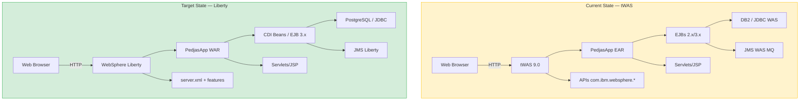

# **Java Modernization Workshop with AMA**

---

## **From tWAS to WebSphere Liberty**

---

This hands-on workshop guides you through the end-to-end modernization journey of an enterprise Java application from **traditional WebSphere Application Server (tWAS)** to **WebSphere Liberty**, using **IBM Application Modernization Accelerator (AMA)** as the analysis and acceleration engine.

| Lab | Module | What you will do |
|-----|--------|------------------|
| [**Lab 0**](lab0/index.en.md) | [**Prerequisites**](lab0/index.en.md) | Configure the environment, review AS-IS / TO-BE architectures, and build PedjasApp |
| [**Lab 1**](lab1/index.en.md) | [**Deploy on tWAS**](lab1/index.en.md) | Package and inspect the legacy EAR application running on traditional WebSphere |
| [**Lab 2**](lab2/index.en.md) | [**AMA Analysis**](lab2/index.en.md) | Run IBM AMA scanner and understand the modernization report and rule definitions |
| [**Lab 3**](lab3/index.en.md) | [**Manual Modernization**](lab3/index.en.md) | Apply step-by-step code modernizations guided by AMA |
| [**Lab 3B**](lab3b/index.en.md) | [**Modernization with Bob**](lab3b/index.en.md) | Accelerated agentic modernization using IBM Bob and AI packages |
| [**Lab 4**](lab4/index.en.md) | [**Deploy on Liberty**](lab4/index.en.md) | Build container image and run on WebSphere Liberty 26.0.0.9 |
| [**Lab 5**](lab5/index.en.md) | [**Validation**](lab5/index.en.md) | Test functional equivalence, health endpoints, and plan next modernization phases |
| [**Lab 6**](lab6/index.en.md) | [**Kubernetes & OpenShift**](lab6/index.en.md) | Deploy to cloud-native cluster using the Open Liberty Operator (Optional) |

---

## The Sample Application: PedjasApp

**PedjasApp** is an enterprise order management system intentionally developed with legacy **Java EE / tWAS** features that AMA is designed to analyze. It includes:

- **Servlets & JSP** for the web presentation tier
- **EJBs 2.x and 3.x** for transactional business logic
- **WebSphere proprietary JNDI bindings** for resource resolution
- **APIs com.ibm.websphere.*** for application server integration
- **JMS on WAS resources** for asynchronous messaging
- **JDBC with WAS DataSource** for relational database persistence

This architecture represents typical enterprise applications analyzed by AMA to produce concrete, actionable modernization rules.

---

## Solution Architecture



---

## General Prerequisites

!!! warning "Before getting started"
    Ensure the following tools and prerequisites are available before starting Lab 0:

    - Java JDK 17 (LTS) installed
    - Apache Maven 3.8+
    - Podman 4.x+ or Docker installed and running
    - Access to IBM Application Modernization Accelerator (AMA / Transformation Advisor)
    - Git and a GitHub account

---

## Repository Structure

```
java-mod-workshop/
├── docs/                         # Workshop documentation (this website)
│   ├── lab0/  … lab6/            # Individual labs
│   ├── styles/                   # Custom theme CSS
│   └── _static/                  # Helper JavaScript
├── pedjasapp-twas/               # Legacy source code (tWAS EAR)
│   └── src/                      # Java, XML, WAS descriptors
├── pedjasapp-liberty/            # Modernized source code (Liberty WAR)
│   ├── src/                      # Modernized Java code
│   ├── server.xml                # Liberty configuration
│   └── Dockerfile                # Liberty container image
├── k8s/                          # Kubernetes & OpenShift manifests
├── mkdocs.yml                    # MkDocs site configuration
└── .github/workflows/deploy.yml  # CI/CD deployment pipeline
```

---

## **Workshop Table of Contents**

---

| LAB | SECTION |
| - | - |
| [**0. Prerequisites**](lab0/index.en.md) | [Overview & Environment Setup](lab0/index.en.md) |
| [**1. Deploy on tWAS**](lab1/index.en.md) | [Deploy PedjasApp on tWAS](lab1/index.en.md) |
| [**2. AMA Analysis**](lab2/index.en.md) | [Run IBM AMA](lab2/index.en.md) |
| [**3. Manual Modernization**](lab3/index.en.md) | [Apply AMA-guided code changes](lab3/index.en.md) |
| [**3B. Modernization with IBM Bob**](lab3b/index.en.md) | [AI-assisted modernization with Bob](lab3b/index.en.md) |
| [**4. Deploy on Liberty**](lab4/index.en.md) | [Deploy on WebSphere Liberty 26.0.0.9](lab4/index.en.md) |
| [**5. Validation**](lab5/index.en.md) | [Validation & next modernization steps](lab5/index.en.md) |
| [**6. Kubernetes & OpenShift**](lab6/index.en.md) | [Cloud-native deployment with Open Liberty Operator](lab6/index.en.md) |
