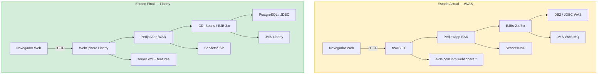

# Workshop de Modernización de Aplicaciones Java

---

## Bienvenido al Workshop

Este workshop práctico te guiará a través del proceso completo de modernización de una aplicación Java empresarial desde **WebSphere Application Server tradicional (tWAS)** hasta **WebSphere Liberty**, utilizando **IBM Application Modernization Accelerator (AMA)** como herramienta de análisis y guía.

---

## ¿Qué vas a aprender?

| Lab | Módulo | Lo que aprenderás |
|-----|--------|-------------------|
| **Lab 0** | Introducción y Requisitos Previos | Arquitectura de la solución, herramientas y configuración del entorno |
| **Lab 1** | Despliegue en tWAS | Desplegar y verificar PedjasApp en WebSphere Application Server tradicional |
| **Lab 2** | Análisis con AMA | Ejecutar IBM AMA y comprender los resultados del análisis de modernización |
| **Lab 3** | Modernización Manual | Aplicar los cambios de código recomendados por AMA |
| **Lab 4** | Despliegue en Liberty | Ejecutar la aplicación modernizada en WebSphere Liberty mediante Docker |
| **Lab 5** | Validación y Siguientes Pasos | Verificar la migración y planificar los próximos pasos |

---

## La aplicación de ejemplo: PedjasApp

**PedjasApp** es un sistema de gestión de pedidos empresarial desarrollado intencionalmente con tecnologías **Java EE / tWAS** que AMA puede analizar. Incluye:

- **Servlets y JSP** para la capa de presentación web
- **EJBs 2.x y 3.x** para la lógica de negocio
- **JNDI propietario de WebSphere** para la resolución de recursos
- **APIs com.ibm.websphere.*** para integración con el servidor
- **JMS sobre recursos WAS** para mensajería asíncrona
- **JDBC con DataSource WAS** para persistencia en base de datos

Esta combinación representa el tipo de aplicación que AMA analiza con mayor detalle, generando reglas de modernización concretas y accionables.

---

## Arquitectura de la solución



---

## Prerrequisitos generales

!!! warning "Antes de comenzar"
    Asegúrate de tener los siguientes elementos disponibles antes de iniciar el Lab 0:

    - Java JDK 11 o superior instalado
    - Apache Maven 3.8+
    - Docker Desktop operativo
    - Acceso a IBM Application Modernization Accelerator
    - Cuenta en GitHub

---

## Estructura del repositorio

```
java-mod-workshop/
├── docs/                         # Contenido del workshop (esta web)
│   ├── lab0/  … lab5/            # Labs individuales
│   ├── styles/                   # CSS personalizado
│   └── _static/                  # JavaScript de apoyo
├── pedjasapp-twas/               # Código fuente — versión tWAS
│   └── src/                      # Java, XML, descriptores WAS
├── pedjasapp-liberty/            # Código fuente — versión Liberty
│   ├── src/                      # Java modernizado
│   ├── server.xml                # Configuración Liberty
│   └── Dockerfile                # Imagen Docker Liberty
├── mkdocs.yml                    # Configuración del sitio
└── .github/workflows/deploy.yml  # Pipeline CI/CD
```

---

## Empezar

Dirígete al **[Lab 0 — Introducción y Requisitos Previos](lab0/index.md)** para comenzar.
