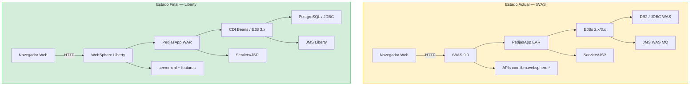

# **Workshop de Modernización Java con AMA**

---

## **De tWAS a WebSphere Liberty**

---

Este workshop práctico te guiará por el proceso completo de modernización de una aplicación Java empresarial desde **WebSphere Application Server tradicional (tWAS)** hasta **WebSphere Liberty**, utilizando **IBM Application Modernization Accelerator (AMA)** como herramienta de análisis y guía.

| Lab | Módulo | Lo que harás |
|-----|--------|-------------|
| [**Lab 0**](lab0/index.md) | [**Requisitos Previos**](lab0/index.md) | Configurar el entorno, revisar la arquitectura AS-IS/TO-BE y compilar PedjasApp |
| [**Lab 1**](lab1/index.md) | [**Despliegue en tWAS**](lab1/index.md) | Preparar y verificar la aplicación en WebSphere Application Server tradicional |
| [**Lab 2**](lab2/index.md) | [**Análisis con AMA**](lab2/index.md) | Ejecutar IBM AMA y comprender las reglas de modernización generadas |
| [**Lab 3**](lab3/index.md) | [**Modernización Manual**](lab3/index.md) | Aplicar los cambios de código guiados por AMA |
| [**Lab 3B**](lab3b/index.md) | [**Modernización con Bob**](lab3b/index.md) | Modernización acelerada con IBM Bob y paquetes de IA |
| [**Lab 4**](lab4/index.md) | [**Despliegue en Liberty**](lab4/index.md) | Construir el Dockerfile y desplegar en WebSphere Liberty 26.0.0.9 |
| [**Lab 5**](lab5/index.md) | [**Validación**](lab5/index.md) | Verificar la migración funcional y planificar los próximos pasos |
| [**Lab 6**](lab6/index.md) | [**Kubernetes & OpenShift**](lab6/index.md) | Desplegar en clúster cloud-native con Open Liberty Operator (Opcional) |

---

## La aplicación de ejemplo: PedjasApp

**PedjasApp** es un sistema de gestión de pedidos empresarial desarrollado intencionalmente con tecnologías **Java EE / tWAS** que AMA puede analizar. Incluye:

- **Servlets y JSP** para la capa de presentación web
- **EJBs 2.x y 3.x** para la lógica de negocio
- **JNDI propietario de WebSphere** para la resolución de recursos
- **APIs com.ibm.websphere.*** para integración con el servidor
- **JMS sobre recursos WAS** para mensajería asíncrona
- **JDBC con DataSource WAS** para persistencia en base de datos

Esta combinación representa el tipo de aplicación que AMA analiza con mayor detalle, generando reglas de modernización concretas y accionables.

---

## Arquitectura de la solución



---

## Prerrequisitos generales

!!! warning "Antes de comenzar"
    Asegúrate de tener los siguientes elementos disponibles antes de iniciar el Lab 0:

    - Java JDK 11 o superior instalado
    - Apache Maven 3.8+
    - Podman 4.x o superior instalado y operativo
    - Acceso a IBM Application Modernization Accelerator
    - Cuenta en GitHub

---

## Estructura del repositorio

```
java-mod-workshop/
├── docs/                         # Contenido del workshop (esta web)
│   ├── lab0/  … lab5/            # Labs individuales
│   ├── styles/                   # CSS personalizado
│   └── _static/                  # JavaScript de apoyo
├── pedjasapp-twas/               # Código fuente — versión tWAS
│   └── src/                      # Java, XML, descriptores WAS
├── pedjasapp-liberty/            # Código fuente — versión Liberty
│   ├── src/                      # Java modernizado
│   ├── server.xml                # Configuración Liberty
│   └── Dockerfile                # Imagen Docker Liberty
├── mkdocs.yml                    # Configuración del sitio
└── .github/workflows/deploy.yml  # Pipeline CI/CD
```

---

## **Índice del Workshop**

---

| LAB | SECCIÓN |
| - | - |
| [**0. Requisitos Previos**](lab0/index.md) | [Introducción y entorno](lab0/index.md) |
| [**1. Despliegue en tWAS**](lab1/index.md) | [Desplegar PedjasApp en tWAS](lab1/index.md) |
| [**2. Análisis con AMA**](lab2/index.md) | [Ejecutar IBM AMA](lab2/index.md) |
| [**3. Modernización Manual**](lab3/index.md) | [Aplicar cambios de código guiados por AMA](lab3/index.md) |
| [**3B. Modernización con IBM Bob**](lab3b/index.md) | [Modernización asistida con Bob + Premium Package](lab3b/index.md) |
| [**4. Despliegue en Liberty**](lab4/index.md) | [Desplegar en WebSphere Liberty 26.0.0.9](lab4/index.md) |
| [**5. Validación**](lab5/index.md) | [Validación y siguientes pasos](lab5/index.md) |
| [**6. Kubernetes & OpenShift**](lab6/index.md) | [Despliegue cloud-native con Open Liberty Operator](lab6/index.md) |
