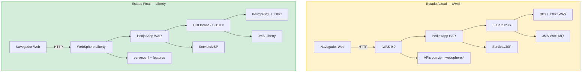

# **Workshop de Modernización Java con AMA**

---

## **i. De tWAS a Open Liberty**

---

Este workshop práctico te guiará por el proceso completo de modernización de una aplicación Java empresarial desde **WebSphere Application Server tradicional (tWAS)** hasta **Open Liberty**, utilizando **IBM Application Modernization Accelerator (AMA)** como herramienta de análisis y guía.

| Lab | Módulo | Lo que harás |
|-----|--------|-------------|
| **0** | **Requisitos Previos** | Configurar el entorno, revisar la arquitectura AS-IS/TO-BE y compilar PedjasApp |
| **1** | **Despliegue en tWAS** | Desplegar y verificar PedjasApp en WebSphere Application Server tradicional |
| **2** | **Análisis con AMA** | Ejecutar IBM AMA y comprender las reglas de modernización generadas |
| **3** | **Modernización Manual** | Aplicar los cambios de código guiados por AMA |
| **4** | **Despliegue en Liberty** | Construir el Dockerfile y desplegar en Open Liberty 26.0.0.9 |
| **5** | **Validación** | Verificar la migración funcional y planificar los próximos pasos |

---

## La aplicación de ejemplo: PedjasApp

**PedjasApp** es un sistema de gestión de pedidos empresarial desarrollado intencionalmente con tecnologías **Java EE / tWAS** que AMA puede analizar. Incluye:

- **Servlets y JSP** para la capa de presentación web
- **EJBs 2.x y 3.x** para la lógica de negocio
- **JNDI propietario de WebSphere** para la resolución de recursos
- **APIs com.ibm.websphere.*** para integración con el servidor
- **JMS sobre recursos WAS** para mensajería asíncrona
- **JDBC con DataSource WAS** para persistencia en base de datos

Esta combinación representa el tipo de aplicación que AMA analiza con mayor detalle, generando reglas de modernización concretas y accionables.

---

## Arquitectura de la solución



---

## Prerrequisitos generales

!!! warning "Antes de comenzar"
    Asegúrate de tener los siguientes elementos disponibles antes de iniciar el Lab 0:

    - Java JDK 11 o superior instalado
    - Apache Maven 3.8+
    - Docker Desktop operativo
    - Acceso a IBM Application Modernization Accelerator
    - Cuenta en GitHub

---

## Estructura del repositorio

```
java-mod-workshop/
├── docs/                         # Contenido del workshop (esta web)
│   ├── lab0/  … lab5/            # Labs individuales
│   ├── styles/                   # CSS personalizado
│   └── _static/                  # JavaScript de apoyo
├── pedjasapp-twas/               # Código fuente — versión tWAS
│   └── src/                      # Java, XML, descriptores WAS
├── pedjasapp-liberty/            # Código fuente — versión Liberty
│   ├── src/                      # Java modernizado
│   ├── server.xml                # Configuración Liberty
│   └── Dockerfile                # Imagen Docker Liberty
├── mkdocs.yml                    # Configuración del sitio
└── .github/workflows/deploy.yml  # Pipeline CI/CD
```

---

## **vi. Índice del workshop**

---

| LAB | SECCIÓN |
| - | - |
| <a href="https://ibm-automation-spgi.github.io/java-mod-workshop/lab0/" target="_blank">**0. Requisitos Previos**</a> | <a href="https://ibm-automation-spgi.github.io/java-mod-workshop/lab0/" target="_blank">Introducción y entorno</a> |
| <a href="https://ibm-automation-spgi.github.io/java-mod-workshop/lab1/" target="_blank">**1. Despliegue en tWAS**</a> | <a href="https://ibm-automation-spgi.github.io/java-mod-workshop/lab1/" target="_blank">Desplegar PedjasApp en tWAS</a> |
| <a href="https://ibm-automation-spgi.github.io/java-mod-workshop/lab2/" target="_blank">**2. Análisis con AMA**</a> | <a href="https://ibm-automation-spgi.github.io/java-mod-workshop/lab2/" target="_blank">Ejecutar IBM AMA</a> |
| <a href="https://ibm-automation-spgi.github.io/java-mod-workshop/lab3/" target="_blank">**3. Modernización Manual**</a> | <a href="https://ibm-automation-spgi.github.io/java-mod-workshop/lab3/" target="_blank">Aplicar cambios de código</a> |
| <a href="https://ibm-automation-spgi.github.io/java-mod-workshop/lab4/" target="_blank">**4. Despliegue en Liberty**</a> | <a href="https://ibm-automation-spgi.github.io/java-mod-workshop/lab4/" target="_blank">Desplegar en Open Liberty 26.0.0.9</a> |
| <a href="https://ibm-automation-spgi.github.io/java-mod-workshop/lab5/" target="_blank">**5. Validación**</a> | <a href="https://ibm-automation-spgi.github.io/java-mod-workshop/lab5/" target="_blank">Validación y siguientes pasos</a> |
