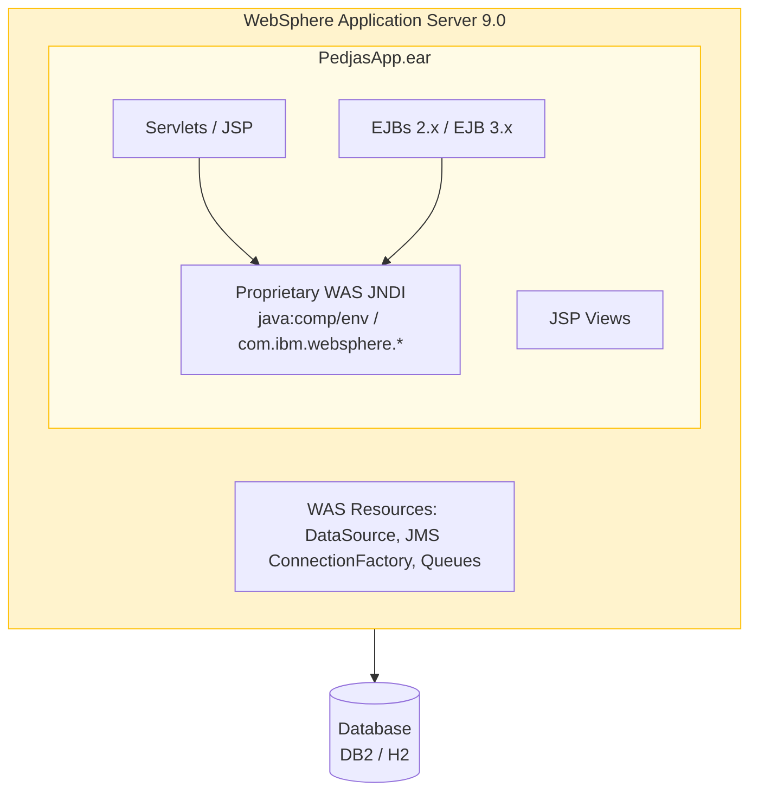
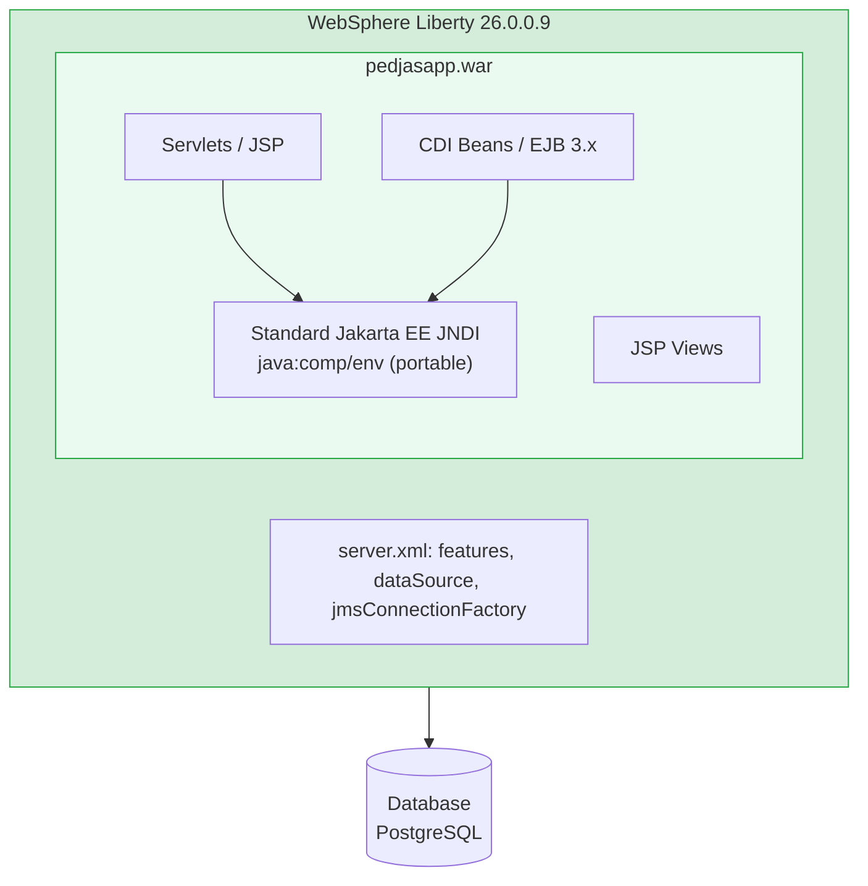

# Lab 0 — Overview & Prerequisites

<span class="lab-badge">Lab 0</span><span class="lab-time">⏱ 10–15 minutes</span>

---

## Workshop Overview

This workshop guides you step-by-step through modernizing a real-world enterprise Java application from **traditional WebSphere Application Server (tWAS)** to **WebSphere Liberty**, leveraging **IBM Application Modernization Accelerator (AMA)** to analyze dependencies, identify migration blockers, and prioritize modernization work.

By the end of this workshop, you will be able to:

- Understand architectural and runtime differences between tWAS and WebSphere Liberty
- Use AMA to generate objective analysis and migration effort estimation
- Apply standard code modifications in a tWAS → Liberty modernization
- Deploy and verify the modernized application running inside a Liberty container

### Estimated Lab Duration

!!! tip "⏱ Estimated duration of this lab: 10–15 minutes"

| Lab | Title | Estimated Time |
|-----|-------|---------------|
| Lab 0 | Prerequisites | 10–15 min |
| Lab 1 | Deploy on tWAS | 15–20 min |
| Lab 2 | AMA Analysis | 15–20 min |
| Lab 3 | Manual Modernization | 25–35 min |
| Lab 3B | Modernization with Bob | 10–15 min |
| Lab 4 | Deploy on Liberty | 15–20 min |
| Lab 5 | Validation | 10–15 min |
| Lab 6 | Kubernetes & OpenShift (Optional) | 20–30 min |

**Total workshop duration (Labs 0–5):** approximately **2 hours**.

---

## Learning Objectives

!!! abstract "Workshop Learning Objectives"
    Upon completing this workshop, you will be able to:

    - **Describe** the purpose and capabilities of IBM Application Modernization Accelerator (AMA)
    - **Package** and inspect a traditional Java EE application structured as an EAR with WebSphere Application Server
    - **Run** an AMA assessment across tWAS profiles and EAR artifacts, and **interpret** the findings
    - **Apply** recommended code changes to eliminate proprietary WebSphere dependencies
    - **Build** and **deploy** the modernized application on WebSphere Liberty in containers
    - **Verify** health probes, metrics, and end-to-end functionality of the modernized Liberty service

---

## Architecture Overview

### Current State (AS-IS)



### Target State (TO-BE)



---

## Required Tools

### Core Software

| Tool | Minimum Version | Purpose | Download Link |
|------|-----------------|---------|---------------|
| Java JDK | 17 (LTS) | Build and compile Java source | [Adoptium](https://adoptium.net/) |
| Apache Maven | 3.8.x | Dependency management and packaging | [maven.apache.org](https://maven.apache.org/) |
| Podman / Docker | 4.x+ | Run tWAS and Liberty containers | [podman.io](https://podman.io/getting-started/installation) |
| IBM AMA | Latest version | Application modernization scanner | See AMA section below |
| Git | 2.x | Version control | [git-scm.com](https://git-scm.com/) |

### Recommended Software

| Tool | Purpose |
|------|---------|
| VS Code or IntelliJ IDEA | Java source code editing |
| Postman or curl | REST API testing |
| DBeaver | Relational database administration |

---

## Accessing IBM Application Modernization Accelerator

IBM Application Modernization Accelerator (AMA) can be used locally via the containerized bundle:

### Option A — IBM Transformation Advisor Local (local installation)

1. Download the installer package from the official IBM page:
   **[ibm.com/support/pages/ibm-transformation-advisor-downloads](https://www.ibm.com/support/pages/ibm-transformation-advisor-downloads)**

2. Extract the archive and execute the startup script:

```bash
unzip application-modernization-accelerator-local-5.1.0.zip
cd application-modernization-accelerator-local-5.1.0
sh launch.sh
```

Access the UI at **[https://localhost/](https://localhost/)** (or **[http://localhost:3000](http://localhost:3000)**).

!!! note "Requirements"
    Requires Docker or Podman running on your system. The script automatically pulls necessary images from ICR.

!!! note "Workshop Terminology"
    Throughout the labs the generic term **AMA** is used to refer to both IBM Transformation Advisor and IBM Application Modernization Accelerator, as they share the same analysis engine and produce the same modernization rules.

---

## Environment Setup

### Step 1 — Clone the Repository

```bash
git clone https://github.com/IBM-Automation-SPGI/java-mod-workshop.git
cd java-mod-workshop
```

### Step 2 — Verify Installed Tools

```bash
# Check Java
java -version

# Check Maven
mvn -version

# Check Podman or Docker
podman version

# Check Git
git --version
```

### Step 3 — Build PedjasApp (tWAS Version)

```bash
cd pedjasapp-twas
mvn clean package -DskipTests
```

After compilation, verify that `pedjasapp-ear/target/pedjasapp.ear` is present.

!!! tip "Pre-generated ZIP archives included"
    The repository already ships pre-generated AMA collection archives so you can proceed directly to Lab 2 without running the Data Collector from scratch:
    - `pedjasapp-collection.zip` — PedjasApp (EAR) collection → used in Lab 2
    - `AppSrv01-collection.zip` — complete tWAS server collection (optional, for full-server scan)

### Step 4 — Build PedjasApp (Liberty Version)

```bash
cd ../pedjasapp-liberty
mvn clean package -DskipTests
```

After compilation, verify that `target/pedjasapp.war` is present.

---

## Project Directory Structure

```
java-mod-workshop/
│
├── pedjasapp-twas/                    # tWAS application source (EAR)
│   ├── pom.xml                        # Root Maven POM
│   ├── pedjasapp-ejb/                 # EJB module
│   │   ├── src/main/java/             # EJB Java code
│   │   └── src/main/resources/        # ejb-jar.xml, ibm-ejb-jar-bnd.xml
│   └── pedjasapp-web/                 # Web module
│       ├── src/main/java/             # Servlets
│       ├── src/main/webapp/           # JSPs, web.xml, ibm-web-bnd.xml
│       └── pom.xml
│
└── pedjasapp-liberty/                 # Modernized Liberty version (WAR)
    ├── pom.xml                        # Single WAR Maven POM
    ├── src/main/java/                 # Modernized Java classes
    ├── src/main/webapp/               # JSPs, standard web.xml
    ├── server.xml                     # Liberty server configuration
    └── Dockerfile                     # Liberty container image
```

---

## Summary

!!! success "Completed"
    In this lab you have reviewed:

    - Workshop objectives and scope
    - AS-IS vs. TO-BE architectural topologies
    - Tool prerequisites and environment verification
    - Initial build and verification of both projects

---

## Next Step

Proceed to **[Lab 1 — Deploy on tWAS](../lab1/index.en.md)** to package and inspect PedjasApp running on traditional WebSphere Application Server.
