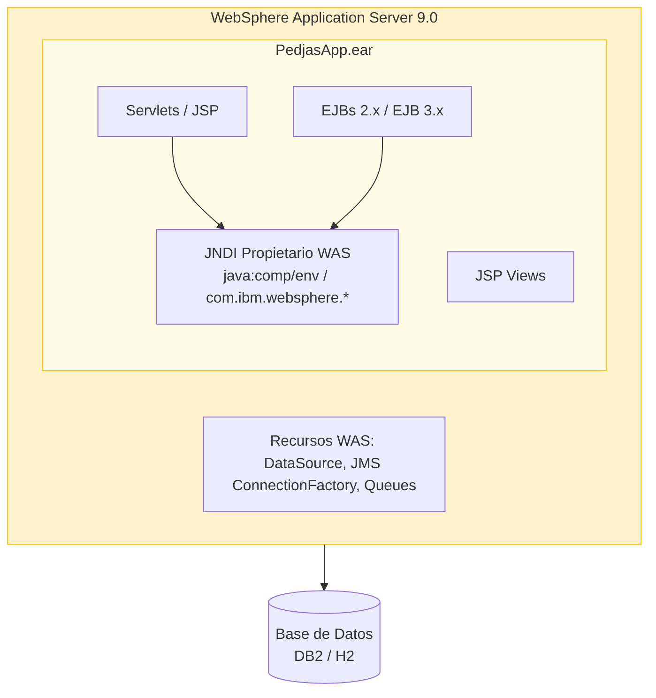
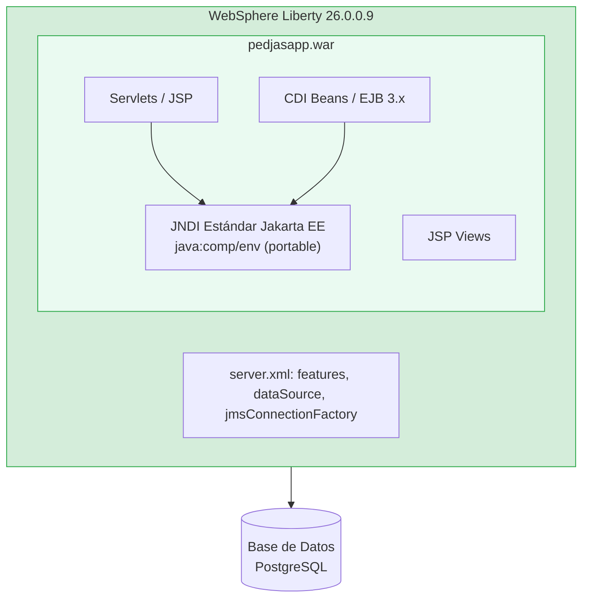

# Lab 0 — Introducción y Requisitos Previos

---

## Descripción del Workshop

Este workshop te guía paso a paso en la modernización de una aplicación Java empresarial real desde **WebSphere Application Server tradicional (tWAS)** hasta **WebSphere Liberty**, apoyándote en **IBM Application Modernization Accelerator (AMA)** para analizar dependencias, identificar problemas de migración y priorizar los cambios necesarios.

Al finalizar, serás capaz de:

- Entender las diferencias arquitectónicas entre tWAS y WebSphere Liberty
- Utilizar AMA para obtener un análisis objetivo del esfuerzo de modernización
- Aplicar los cambios de código más habituales en una migración tWAS → Liberty
- Desplegar y verificar la aplicación modernizada en un contenedor Liberty

---

## Objetivos de Aprendizaje

<div class="objetivos-box">

Al completar este workshop serás capaz de:

- **Describir** el propósito y las capacidades de IBM Application Modernization Accelerator (AMA)
- **Desplegar** una aplicación Java EE en WebSphere Application Server tradicional usando Docker
- **Ejecutar** un análisis AMA sobre una aplicación EAR/WAR y **interpretar** sus resultados
- **Aplicar** las modificaciones de código recomendadas por AMA para eliminar dependencias propietarias de tWAS
- **Construir** y **desplegar** la aplicación modernizada en WebSphere Liberty mediante Docker
- **Verificar** la equivalencia funcional entre la versión tWAS y la versión Liberty

</div>

---

## Arquitectura de la Solución

### Estado Actual (AS-IS)



### Estado Objetivo (TO-BE)



---

## Herramientas Necesarias

### Software Obligatorio

| Herramienta | Versión Mínima | Propósito | Enlace de Descarga |
|-------------|---------------|-----------|-------------------|
| Java JDK | 17 (LTS) | Compilar el código fuente Java | [Adoptium](https://adoptium.net/) |
| Apache Maven | 3.8.x | Gestión de dependencias y compilación | [maven.apache.org](https://maven.apache.org/) |
| Podman | 4.x o superior | Ejecutar tWAS y Liberty en contenedor | [podman.io](https://podman.io/getting-started/installation) |
| IBM AMA | Última versión | Análisis de modernización | Ver sección AMA más abajo |
| Git | 2.x | Control de versiones | [git-scm.com](https://git-scm.com/) |

### Software Recomendado

| Herramienta | Propósito |
|-------------|-----------|
| VS Code o IntelliJ IDEA | Edición del código fuente |
| Postman o curl | Prueba de endpoints REST |
| DBeaver | Administración de base de datos |

---

## Acceso a IBM Application Modernization Accelerator

IBM Application Modernization Accelerator (AMA) se puede utilizar de dos formas:

### Opción A — IBM Transformation Advisor Local (instalación local)

La imagen `ibmcom/transformation-advisor-dev` ya no está disponible. La instalación oficial se realiza mediante el script `launchTransformationAdvisor.sh` descargado desde IBM:

1. Descarga el instalador desde la página oficial:
   **[ibm.com/support/pages/ibm-transformation-advisor-downloads](https://www.ibm.com/support/pages/ibm-transformation-advisor-downloads)**

2. Extrae el ZIP y ejecuta el script de arranque:

```bash
unzip application-modernization-accelerator-local-5.1.0.zip
cd application-modernization-accelerator-local-5.1.0
sh launch.sh
```

Accede a la interfaz en `https://localhost/` (o `http://localhost:3000` según la versión).

!!! note "Requisitos"
    Requiere Docker o Podman instalado en el sistema. El script gestiona la descarga de las imágenes necesarias automáticamente.

!!! note "Nota para el Workshop"
    A lo largo de los labs se utilizará la terminología genérica **AMA** para referirse tanto a IBM Transformation Advisor como a IBM Application Modernization Accelerator, ya que comparten el mismo motor de análisis y generan las mismas reglas de modernización.

---

## Configuración del Entorno Local

### Paso 1 — Clonar el repositorio del workshop

```bash
git clone https://github.com/IBM-Automation-SPGI/java-mod-workshop.git
cd java-mod-workshop
```

### Paso 2 — Verificar las herramientas instaladas

```bash
# Verificar Java
java -version
# Salida esperada: openjdk version "17.x.x" o superior ...

# Verificar Maven
mvn -version
# Salida esperada: Apache Maven 3.8.x ...

# Verificar Podman
podman version
# Salida esperada: Client:       Podman Engine
#                  Version:      4.x.x ...

# Verificar Git
git --version
# Salida esperada: git version 2.x.x
```

### Paso 3 — Compilar PedjasApp (versión tWAS)

```bash
cd pedjasapp-twas
mvn clean package -DskipTests
```

Tras la compilación, encontrarás el fichero EAR en `pedjasapp-ear/target/pedjasapp.ear`.

### Paso 4 — Verificar la compilación de la versión Liberty

```bash
cd ../pedjasapp-liberty
mvn clean package -DskipTests
```

Tras la compilación, encontrarás el fichero WAR en `target/pedjasapp.war`.

---

## Estructura de Directorios del Proyecto

```
java-mod-workshop/
│
├── pedjasapp-twas/                    # Aplicación versión tWAS
│   ├── pom.xml                        # POM Maven raíz (EAR)
│   ├── pedjasapp-ejb/                 # Módulo EJB
│   │   ├── src/main/java/             # Código Java de los EJBs
│   │   └── src/main/resources/        # ejb-jar.xml, ibm-ejb-jar-bnd.xml
│   └── pedjasapp-web/                 # Módulo Web
│       ├── src/main/java/             # Servlets
│       ├── src/main/webapp/           # JSPs, web.xml, ibm-web-bnd.xml
│       └── pom.xml
│
└── pedjasapp-liberty/                 # Aplicación versión Liberty
    ├── pom.xml                        # POM Maven (WAR único)
    ├── src/main/java/                 # Código Java modernizado
    ├── src/main/webapp/               # JSPs, web.xml estándar
    ├── server.xml                     # Configuración Liberty
    └── Dockerfile                     # Imagen Docker Liberty
```

---

## Resumen del Lab 0

!!! success "Completado"
    En este lab has revisado:

    - Los objetivos y el alcance del workshop
    - La arquitectura AS-IS y TO-BE de la solución
    - Las herramientas necesarias y cómo verificarlas
    - La estructura del repositorio y la compilación inicial

---

## Siguiente Paso

Continúa con el **[Lab 1 — Despliegue en tWAS](../lab1/index.md)**, donde desplegarás PedjasApp en un contenedor Docker con WebSphere Application Server tradicional y verificarás su funcionamiento antes del análisis AMA.
