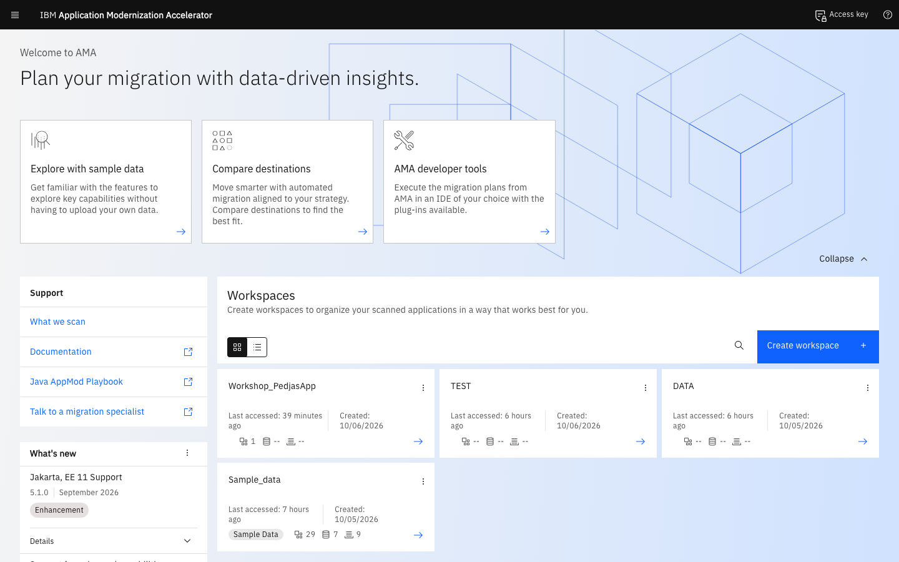
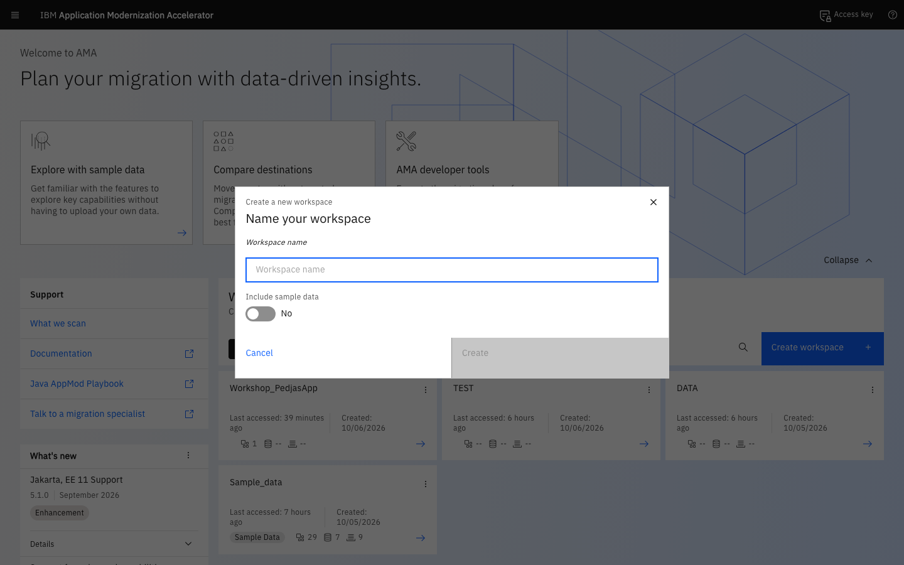
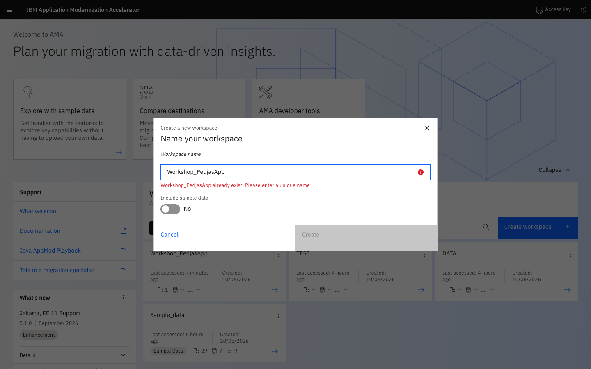
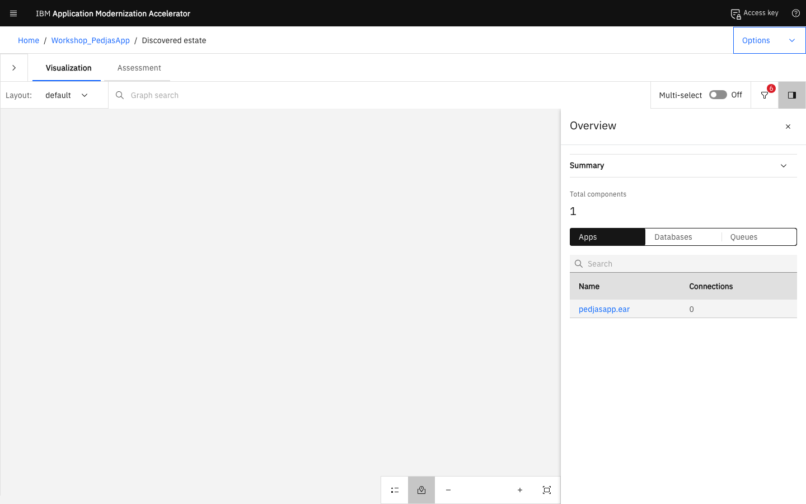
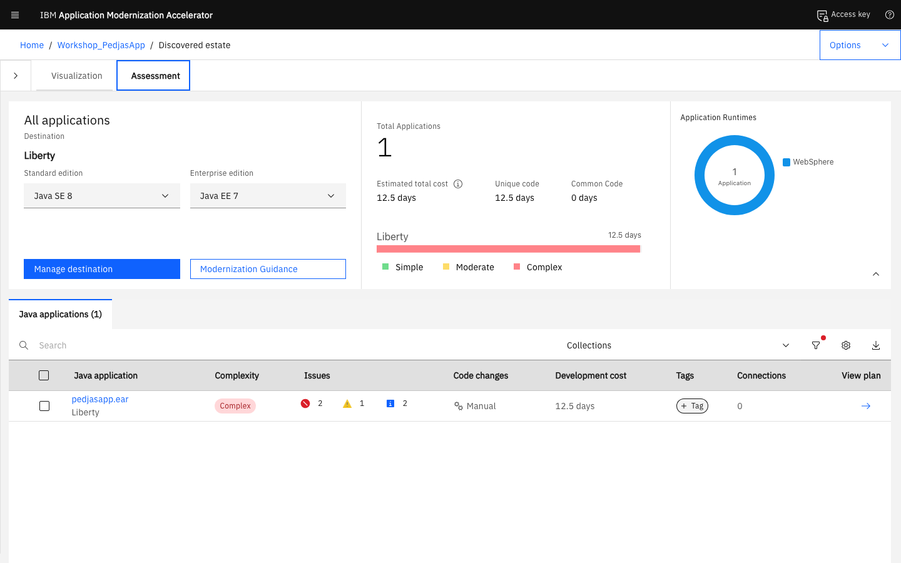
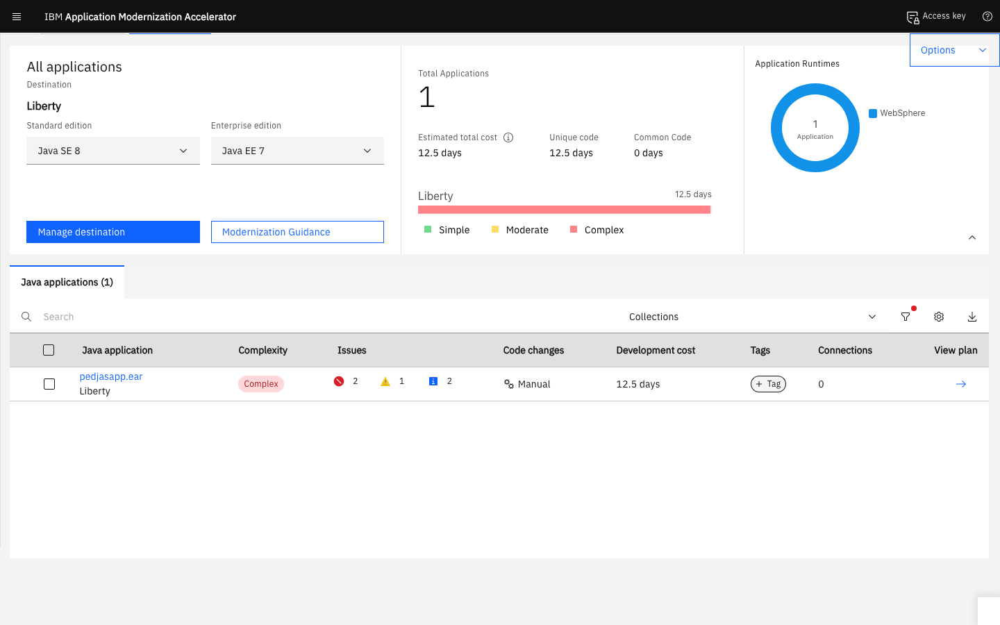
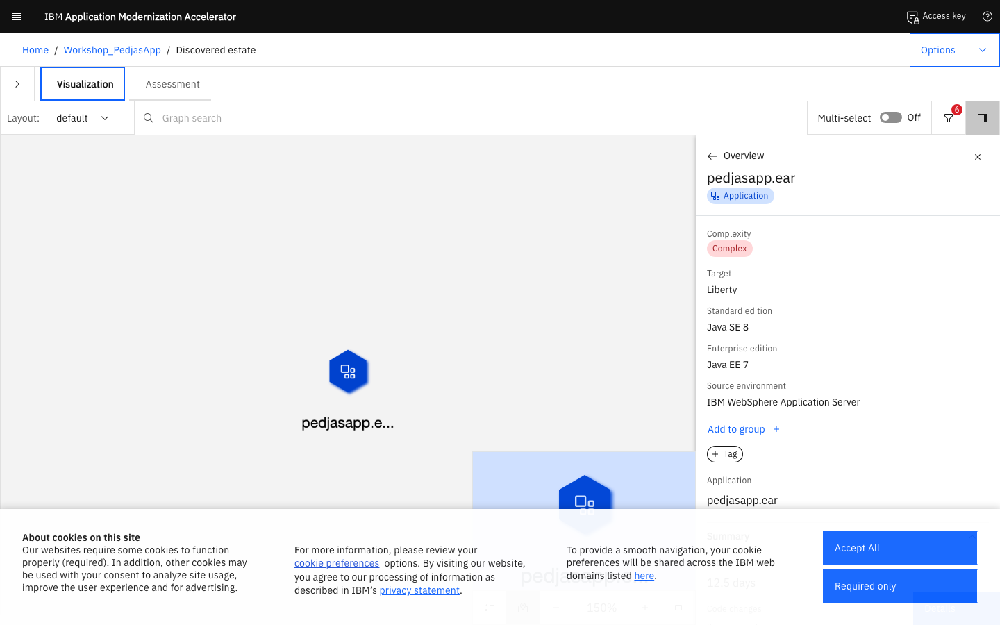

# Lab 2 — Análisis con IBM Application Modernization Accelerator

---

## Objetivo del Lab

En este lab ejecutarás **IBM Application Modernization Accelerator (AMA)** sobre el fichero EAR de PedjasApp, interpretarás los resultados del análisis y priorizarás los cambios necesarios para la migración a WebSphere Liberty.

---

## ¿Qué es IBM AMA / Transformation Advisor?

**IBM Application Modernization Accelerator** es una herramienta de análisis estático que:

- Escanea los binarios de una aplicación Java EE (EAR, WAR, JAR) sin necesidad de acceso al código fuente
- Detecta dependencias propietarias del servidor de aplicaciones de origen (tWAS, JBoss, WebLogic, etc.)
- Genera reglas de modernización específicas para cada problema encontrado
- Estima el nivel de esfuerzo (bajo / medio / alto) de la migración
- Produce un plan de acción priorizado con los cambios más críticos primero
- Genera ficheros de configuración de destino (p. ej., `server.xml` para Liberty) como punto de partida

---

## Paso 1 — Instalación de AMA (Transformation Advisor)

### Opción A — Instalación Local (Recomendada para el Workshop)

La imagen `ibmcom/transformation-advisor-dev` ya no está disponible públicamente. AMA Local (v4.x/v5.x) se instala mediante un ZIP descargado desde IBM:

1. Descarga el instalador desde:
   **[ibm.com/support/pages/ibm-transformation-advisor-downloads](https://www.ibm.com/support/pages/ibm-transformation-advisor-downloads)**

2. Extrae el ZIP y lanza el script de arranque:

```bash
unzip application-modernization-accelerator-local-5.1.0.zip
cd application-modernization-accelerator-local-5.1.0
sh launch.sh
```

!!! note "Nombre del script según la versión"
    - AMA 5.x y 4.x: el script se llama `launch.sh`
    - Transformation Advisor 3.x: el script se llamaba `launchTransformationAdvisor.sh`

```bash
# Verificar que los contenedores están activos
podman ps | grep -i ama
```

Accede a la interfaz en: **[https://localhost/](https://localhost/)** (o **[http://localhost:3000](http://localhost:3000)** en versiones clásicas)



!!! note "Requisitos"
    Requiere Docker o Podman instalado. El script descarga automáticamente las imágenes necesarias desde ICR.

---

## Paso 2 — Crear un Nuevo Workspace en AMA

Cuando accedas a la interfaz de Transformation Advisor por primera vez:

### 2.1 Crear un Workspace

1. Haz clic en el botón **Create workspace** en la pantalla principal.
2. Introduce el nombre del workspace en el campo **Workspace name**:

```
Nombre: "Workshop_PedjasApp"
→ Create
```





**Vista del workspace tras la creación:**



### 2.2 Explorar datos o importar nuevo escaneo

En la interfaz moderna de AMA (v4.x/v5.x):
- Puedes explorar el workspace de demostración **Sample_data** para familiarizarte con las vistas de **Visualization**, **Assessment** y **Migration plan**.
- Para cargar nuevos análisis de aplicaciones, utiliza la opción superior **Bulk data → Upload** o el asistente de carga.

---

## Paso 3 — Generar la Colección con el Data Collector y Subirla a AMA

El **Data Collector de AMA** permite escanear servidores WebSphere tradicionales completos o binarios de aplicaciones (`.ear`, `.war`), evaluando incompatibilidades, reglas de arquitectura y dependencias hacia Liberty.

El flujo de trabajo consta de dos partes:

1. **Generación del archivo `.zip` de la colección** con el analizador de binarios / Data Collector.

2. **Subida del `.zip` a AMA** (a través de la **interfaz gráfica Web** o mediante la **API REST**).

---

### 3.1 Cómo Generar el Archivo ZIP con el Data Collector

El Data Collector viene empaquetado en el contenedor de AMA (`taserver`). Para ejecutar el escaneo directamente sobre el contenedor `pedjasapp-twas`, extraemos el bundle del recolector y ejecutamos el análisis con los comandos completos a continuación.

#### Paso previo: Extraer el Data Collector en el contenedor de tWAS
```bash
# 1. Crear directorio en el contenedor de tWAS
podman exec pedjasapp-twas mkdir -p /tmp/ta-collector

# 2. Extraer el paquete del collector de Linux desde el servidor AMA hacia el contenedor tWAS
podman exec taserver cat /opt/ibm/wlp/usr/servers/defaultServer/apps/expanded/lands_advisor.war/transformationadvisor-Linux.tgz | podman exec -i pedjasapp-twas tar -xzf - -C /tmp/ta-collector
```

---

#### Opción 1 — Escaneo del servidor tWAS completo desde el contenedor (todos los perfiles)
```bash
# Ejecutar el collector sobre la instalación del servidor en /opt/IBM/WebSphere/AppServer
podman exec pedjasapp-twas \
  /tmp/ta-collector/transformationadvisor-5.1.0/jre/bin/java \
  -jar /tmp/ta-collector/transformationadvisor-5.1.0/lib/ta.binaryAppScanner-26.3.1.0.jar \
  /opt/IBM/WebSphere/AppServer \
  --dc \
  --all-profiles \
  --output=/tmp/ta-output \
  --noProgressIndicator

# Copiar el ZIP generado al host local
podman exec pedjasapp-twas cat /tmp/ta-output/AppSrv01.zip > ./AppSrv01-collection.zip
```
> Genera el archivo: `./AppSrv01-collection.zip`

---

#### Opción 2 — Escaneo del artefacto empresarial (`pedjasapp.ear`) hacia Liberty (Jakarta EE 10 / Java 17)
```bash
# Ejecutar el escaneo del EAR con destino Liberty y Java 17
podman exec pedjasapp-twas \
  /tmp/ta-collector/transformationadvisor-5.1.0/jre/bin/java \
  -jar /tmp/ta-collector/transformationadvisor-5.1.0/lib/ta.binaryAppScanner-26.3.1.0.jar \
  /tmp/pedjasapp.ear \
  --dc \
  --sourceAppServer=was90 \
  --sourceJava=ibm8 \
  --targetJava=java21 \
  --output=/tmp/ta-output-pedjas \
  --noProgressIndicator

# Copiar el ZIP generado al host local
podman exec pedjasapp-twas cat /tmp/ta-output-pedjas/pedjasapp.zip > ./pedjasapp-collection.zip
```
> Genera el archivo: `./pedjasapp-collection.zip`

---

### 3.2 Cómo Subir la Colección a AMA

Tienes dos métodos disponibles para ingestar el archivo `.zip`:

#### Método A — Subida a través de la Interfaz Web (GUI) de AMA
1. Abre tu navegador web y accede a la consola de AMA en **[https://localhost/](https://localhost/)**.
2. Entra en tu Workspace (por ejemplo, el recién creado o haz clic en **Create workspace**).
3. En la pantalla inicial del Workspace, haz clic en el botón central **Upload results** (o en la barra superior en **Bulk data → Upload**).
4. Se abrirá la ventana modal **Upload data**. Arrastra o haz clic en la zona central (*"Drag and drop files here or click to upload"*) para seleccionar tu archivo ZIP generado (`pedjasapp.zip` / `pedjasapp-collection.zip` o `AppSrv01-collection.zip`).
5. Puedes dejar marcada la opción **Autodetect collection** o asignarle un nombre (p. ej., `PedjasApp_tWAS`) y pulsa en el botón azul **Upload**.
6. En unos segundos, la interfaz procesará los binarios y mostrará automáticamente la vista de **Recommendations**, los gráficos de **Visualization** y el desglose de reglas de modernización.

---

#### Método B — Subida Automatizada por Línea de Comandos / API REST de AMA

Puedes realizar la creación del workspace, la subida del `.zip` y la consulta del informe **100% por línea de comandos** utilizando la API REST de AMA expuesta en el puerto seguro `2220` (**[https://localhost:2220/lands_advisor/advisor/v2/workspaces](https://localhost:2220/lands_advisor/advisor/v2/workspaces)**).

##### 1. Crear o Consultar el Workspace por Comando
```bash
# Crear un nuevo workspace para el workshop
WORKSPACE_ID=$(curl -k -s -X POST https://localhost:2220/lands_advisor/advisor/v2/workspaces \
  -H "Content-Type: application/json" \
  -d '{"name": "Workshop_PedjasApp"}' | python3 -c "import sys, json; print(json.load(sys.stdin).get('id'))")

echo "Workspace ID: $WORKSPACE_ID"
```
*(Si el workspace ya existe, puedes listar y obtener su ID con: `curl -k -s https://localhost:2220/lands_advisor/advisor/v2/workspaces | python3 -m json.tool`)*.

##### 2. Subir el Archivo ZIP de la Colección por Comando (curl)
```bash
# Opción 1: Subir desde el host local
curl -k -X POST "https://localhost:2220/lands_advisor/advisor/v2/workspaces/${WORKSPACE_ID}/collectionArchives?collectionName=PedjasApp_tWAS&overwrite=true" \
  -H "Content-Type: application/octet-stream" \
  -H "archiveName: pedjasapp.zip" \
  --data-binary "@./pedjasapp-collection.zip"

# Opción 2: Subir directamente desde el contenedor tWAS (sin copiar al host)
podman exec pedjasapp-twas curl -k -X POST \
  "https://taserver:9443/lands_advisor/advisor/v2/workspaces/${WORKSPACE_ID}/collectionArchives?collectionName=PedjasApp_tWAS&overwrite=true" \
  -H "Content-Type: application/octet-stream" \
  -H "archiveName: pedjasapp.zip" \
  --data-binary "@/tmp/ta-output-pedjas/pedjasapp.zip"
```

##### 3. Consultar las Unidades de Evaluación y Métricas por Comando
```bash
# Listar las aplicaciones procesadas en el Workspace
curl -k -s "https://localhost:2220/lands_advisor/advisor/v2/workspaces/${WORKSPACE_ID}/assessmentUnits" | python3 -m json.tool

# Obtener desglose de costes, esfuerzo y reglas disparadas para pedjasapp
ASSESSMENT_ID=$(curl -k -s "https://localhost:2220/lands_advisor/advisor/v2/workspaces/${WORKSPACE_ID}/assessmentUnits" | python3 -c "import sys, json; print(json.load(sys.stdin)['assessmentUnits'][0]['id'])")

curl -k -s "https://localhost:2220/lands_advisor/advisor/v2/workspaces/${WORKSPACE_ID}/costDetails/assessmentUnits/${ASSESSMENT_ID}" | python3 -m json.tool
```

---

## Paso 4 — Interpretar los Resultados del Análisis

Tras completar el análisis, Transformation Advisor mostrará un resumen con la siguiente estructura:

### 4.1 Pantalla de Resumen de Aplicaciones

La pestaña **Assessment** muestra una tabla con todas las aplicaciones analizadas, sus métricas de complejidad, el esfuerzo estimado de migración y el número de reglas disparadas por severidad:



### 4.2 Clasificación de Issues

| Nivel | Color | Significado |
|-------|-------|-------------|
| **Crítico** | 🔴 Rojo | Bloqueante — la aplicación no arrancará en Liberty sin este cambio |
| **Advertencia** | 🟡 Amarillo | Comportamiento diferente — necesita pruebas adicionales |
| **Informativo** | 🔵 Azul | Mejora recomendada — no bloquea el despliegue |

### 4.3 Reglas Disparadas en PedjasApp

Al hacer clic en `pedjasapp.ear` en la vista de Assessment se accede al **detalle de la aplicación**, que muestra la complejidad, el coste de desarrollo estimado y el desglose de issues con los objetivos **Java SE 21** y **Jakarta EE 10** seleccionados:


El panel muestra:
- **Complejidad:** Complex
- **Issues:** 3 🔴 Críticos, 1 🟡 Advertencia, 6 🔵 Informativos
- **Cambios de código:** Part-automated (recetas OpenRewrite disponibles)
- **Coste de desarrollo:** 12,5 días

El informe real de PedjasApp genera **10 reglas disparadas / 24 resultados totales** con objetivo Jakarta EE 10 / Java 21:

| Severidad | Reglas | Resultados |
|-----------|--------|------------|
| 🔴 Crítico | 3 | 14 |
| 🟡 Advertencia | 1 | 1 |
| 🔵 Informativo | 6 | 9 |

A continuación se describen las reglas principales que AMA genera para PedjasApp:

---

#### 🔴 CR-001 — Actualizar el nombre de paquete a Jakarta EE *(Jakarta EE 9)*

**Ficheros afectados:** 11 ocurrencias en toda la aplicación

**Descripción:**
La aplicación usa el namespace `javax.*` de Java EE. A partir de Jakarta EE 9, todos los paquetes se renombraron de `javax.*` a `jakarta.*`. Este cambio es **obligatorio** para ejecutar en Liberty con Jakarta EE 9+.

**Código problemático:**
```java
import javax.ejb.Stateless;
import javax.persistence.Entity;
import javax.jms.Queue;
import javax.servlet.http.HttpServlet;
```

**Acción correctiva (con OpenRewrite — automatizable):**
```java
import jakarta.ejb.Stateless;
import jakarta.persistence.Entity;
import jakarta.jms.Queue;
import jakarta.servlet.http.HttpServlet;
```
> 💡 Esta regla tiene receta OpenRewrite asociada (icono ⚙️ en el informe). Puede aplicarse automáticamente con `mvn rewrite:run`.

---

#### 🔴 CR-002 — Entity Enterprise JavaBeans (EJB) no disponibles *(Java Technology Support for Liberty)*

**Ficheros afectados:** 1 resultado

**Descripción:**
Los Entity Beans con Container-Managed Persistence (CMP) de EJB 2.x (`ProductoBean implements EntityBean`) no están soportados en WebSphere Liberty. Liberty únicamente soporta EJB 3.x con Jakarta Persistence (JPA).

**Código problemático:**
```java
public abstract class ProductoBean implements EntityBean {
    public abstract String getNombre();
    public abstract void setNombre(String nombre);
    public abstract java.util.Collection ejbSelectByCategoria(String cat);
}
```

**Acción correctiva:**
- Convertir los Entity Beans CMP a entidades JPA (`@Entity`)
- Reemplazar el Home Interface por un DAO o un `@Stateless` Session Bean

---

#### 🔴 CR-003 — APIs y descriptores propietarios WebSphere *(WebSphere traditional to Liberty)*

**Descripción:**
La aplicación usa APIs `com.ibm.websphere.*`, descriptores de binding WAS (`ibm-web-bnd.xml`, `ibm-ejb-jar-bnd.xml`) y namespaces JNDI propietarios que no existen en Liberty.

**Acción correctiva:**
- Eliminar imports `com.ibm.websphere.*` y sustituir por equivalentes estándar Jakarta EE
- Mover los bindings de `ibm-web-bnd.xml` al elemento `<dataSource>` de `server.xml`
- Usar `@Resource` injection estándar en lugar de lookups JNDI manuales

---

#### 🟡 WA-001 — Conectividad JMS *(WebSphere traditional to Liberty)*

**Ficheros afectados:** 1 resultado

**Descripción:**
La aplicación usa una `QueueConnectionFactory` configurada mediante recursos WAS. Liberty usa su propio proveedor JMS integrado (`messagingServer-3.0`) o un adaptador externo.

**Acción correctiva:**
- Definir `<jmsConnectionFactory>` y `<jmsQueue>` en `server.xml`
- Habilitar las features `messaging-3.1`, `messagingServer-3.0` y `messagingClient-3.0`

---

#### 🔵 IN-001 a IN-006 — Consideraciones informativas

| Regla informativa | Resultados | Categoría |
|-------------------|------------|-----------|
| Databases (conectividad cloud) | 4 | Technology connectivity for IBM Cloud |
| Java Message Service (JMS) | 1 | Connectivity (not Liberty Core) |
| Unmanaged threads | — | All application servers |
| JVM configuration properties | — | All application servers |
| System modules compatibility | — | All application servers |
| URL host/port cloud access | — | Cloud connectivity |

> Las reglas informativas no bloquean el despliegue pero deben revisarse antes de producción.

---

### 4.4 Panel de Análisis Detallado — Vista de Fichero

Al expandir cualquier regla de la lista se muestra el detalle de la incidencia con la descripción, los ficheros afectados y la solución propuesta:



La vista **Visualization** ofrece una representación gráfica de las dependencias y el estado de modernización:



### 4.5 Informe Detallado de Análisis

AMA genera también un **Informe HTML de Análisis** completo con todas las reglas disparadas, su severidad, los ficheros afectados y fragmentos de código. Accede desde la vista de detalle de la aplicación:

```
Aplicación: pedjasapp.ear
→ (menú de la fila) → View full analysis report
```

El informe muestra cuatro secciones principales:

1. **Cabecera y resumen de severidad** — recuento de reglas por nivel (Critical, Warning, Information)
2. **Sección de reglas Críticas** — lista expandible con descripción, ficheros afectados y fragmentos de código
3. **Detalle de regla individual** — al hacer clic en una fila se expanden los ficheros y el fragmento de código problemático
4. **Sección de reglas de Advertencia / Informativas** — cambios recomendados de menor prioridad

!!! tip "Capturar el informe"
    Puedes regenerar las capturas reales del informe ejecutando el script Playwright cuando AMA esté activo:
    ```bash
    node scripts/capture-lab2-screenshots.cjs
    ```
    Esto generará automáticamente `14-analysis-report-top.png`, `15-analysis-report-critical.png`, `16-analysis-report-rule-detail.png` y `17-analysis-report-info.png` en `docs/lab2/img/`.

---

## Paso 5 — Generar el Plan de Migración

Transformation Advisor puede generar automáticamente los artefactos de partida para Liberty:

### 5.1 Descargar la Guía de Migración

```
Aplicación: pedjasapp.ear (o en la vista de detalle de cualquier aplicación analizada)
→ View migration plan
→ Download plan (ZIP)
```

El ZIP incluye:
- `server.xml` — configuración inicial de Liberty (puede necesitar ajustes)
- `Dockerfile` — imagen de contenedor Liberty básica
- `migration-plan.md` — descripción de los cambios necesarios

### 5.2 Tabla Resumen de Reglas Activadas

*(Objetivo: Liberty + Jakarta EE 10 + Java 21 — 10 reglas / 24 resultados)*

| Regla AMA | Severidad | Resultados | Categoría |
|-----------|-----------|------------|-----------|
| CR-001 — Actualizar a nombre de paquete Jakarta EE | 🔴 Crítico | 11 | Jakarta EE 9 |
| CR-002 — Entity EJBs no disponibles (CMP) | 🔴 Crítico | 1 | Java Technology Support for Liberty |
| CR-003 — APIs/descriptores propietarios WebSphere | 🔴 Crítico | 2 | WebSphere traditional to Liberty |
| WA-001 — Conectividad JMS | 🟡 Advertencia | 1 | WebSphere traditional to Liberty |
| IN-001 — Databases (cloud connectivity) | 🔵 Informativo | 4 | Technology connectivity for IBM Cloud |
| IN-002 — Java Message Service (JMS) | 🔵 Informativo | 1 | Connectivity (not Liberty Core) |
| IN-003 a IN-006 — Consideraciones generales | 🔵 Informativo | 4 | All application servers / Cloud |

**Esfuerzo total estimado: 3-5 días de trabajo de desarrollo**
*(La regla CR-001 puede aplicarse automáticamente con la receta OpenRewrite de Liberty Modernization)*

---

## Resumen del Lab 2

!!! success "Completado"
    En este lab has:

    - Instalado y arrancado IBM Transformation Advisor / AMA
    - Cargado el EAR de PedjasApp para su análisis
    - Identificado las **10 reglas de modernización** (3 Críticas, 1 Advertencia, 6 Informativas)
    - Comprendido el nivel de severidad, el recuento de resultados y el esfuerzo de cada cambio
    - Generado el plan de migración inicial

---


## Siguiente Paso

Continúa con el **[Lab 3 — Modernización Manual](../lab3/index.md)** (o con el **[Lab 3B — Modernización con Bob](../lab3b/index.md)**) para aplicar en el código los cambios identificados por AMA.
