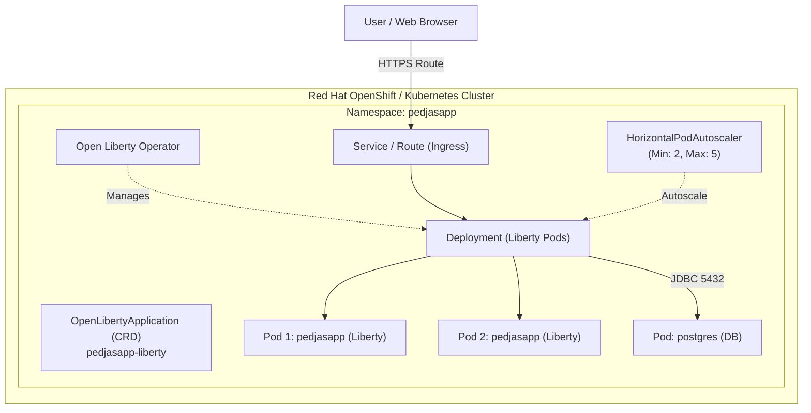

# Lab 6 (Optional) — Deploy on Kubernetes / Red Hat OpenShift with Open Liberty Operator

---

## Lab Objective

In this advanced lab you will deploy the modernized **PedjasApp Liberty** application on a **Kubernetes** or **Red Hat OpenShift** cluster, taking full advantage of the **Open Liberty Operator** for lifecycle management, auto-scaling (HPA), and automated health probes.



---

## 1. Install Open Liberty Operator

The **Open Liberty Operator** simplifies container operations using Custom Resource Definitions (CRDs).

### On Red Hat OpenShift
1. Open the OpenShift web console.
2. Navigate to **OperatorHub** and search for **Open Liberty**.
3. Click **Install** accepting default settings.

### On Standard Kubernetes (CLI)
```bash
# Install CRDs
kubectl apply -f https://raw.githubusercontent.com/OpenLiberty/open-liberty-operator/main/deploy/releases/1.4.0/openliberty-app-crd.yaml

# Install Operator
kubectl apply -f https://raw.githubusercontent.com/OpenLiberty/open-liberty-operator/main/deploy/releases/1.4.0/openliberty-app-operator.yaml
```

---

## 2. Deploy PostgreSQL Database

Deploy PostgreSQL manifests inside the `pedjasapp` namespace:

```bash
kubectl apply -f k8s/postgres-deployment.yaml
```

Verify pod readiness:
```bash
kubectl get pods -n pedjasapp -l app=postgres
```

---

## 3. Build and Push Container Image

```bash
# 1. Compile modernized WAR
cd pedjasapp-liberty
mvn clean package -DskipTests

# 2. Build container image
podman build -t pedjasapp-liberty:latest -f Dockerfile .
```

---

## 4. Deploy with `OpenLibertyApplication` Custom Resource

Apply `k8s/open-liberty-application.yaml`:

```bash
kubectl apply -f k8s/open-liberty-application.yaml
```

Inspect deployment status:
```bash
kubectl get openlibertyapplications -n pedjasapp
kubectl get pods -n pedjasapp -l app.kubernetes.io/name=pedjasapp-liberty
```

---

## Summary

!!! success "Completed"
    You have:

    - Installed the Open Liberty Operator
    - Deployed a resilient PostgreSQL backend
    - Operationalized PedjasApp on Kubernetes / OpenShift with automatic MicroProfile health probe bindings and replica autoscaling
