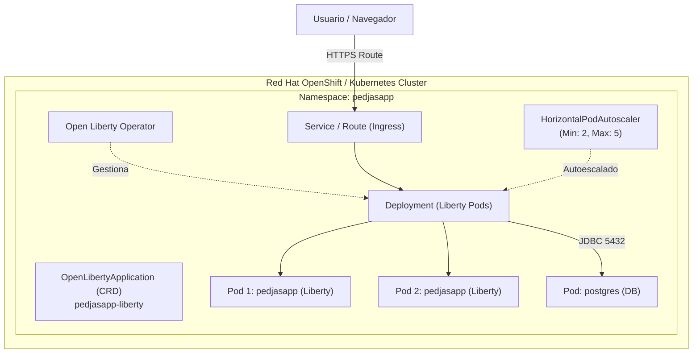

# Lab 6 (Opcional) — Despliegue en Kubernetes / Red Hat OpenShift con Open Liberty Operator

---

## Objetivo del Lab

En este laboratorio avanzado desplegarás la aplicación modernizada **PedjasApp Liberty** en un clúster de **Kubernetes** o **Red Hat OpenShift**, aprovechando las ventajas del **Open Liberty Operator** para gestionar el ciclo de vida, alta disponibilidad, autoescalado (HPA) y sondas de salud automáticas.



---

## 1. Instalación del Open Liberty Operator

El **Open Liberty Operator** facilita la operación de aplicaciones Liberty en Kubernetes mediante Custom Resource Definitions (CRDs).

### En Red Hat OpenShift
1. Abre la consola web de OpenShift.
2. Navega a **OperatorHub** y busca **Open Liberty**.
3. Haz clic en **Install** manteniendo las opciones por defecto (Namespace `openshift-operators` o `pedjasapp`).

### En Kubernetes estándar (CLI)
```bash
# Instalar los CRDs del Open Liberty Operator
kubectl apply -f https://raw.githubusercontent.com/OpenLiberty/open-liberty-operator/main/deploy/releases/1.4.0/openliberty-app-crd.yaml

# Instalar el operador en el clúster
kubectl apply -f https://raw.githubusercontent.com/OpenLiberty/open-liberty-operator/main/deploy/releases/1.4.0/openliberty-app-operator.yaml
```

---

## 2. Despliegue de la Base de Datos PostgreSQL

Creamos el namespace `pedjasapp` y la base de datos PostgreSQL utilizando los manifiestos en `k8s/postgres-deployment.yaml`:

```bash
kubectl apply -f k8s/postgres-deployment.yaml
```

Verifica que el pod de PostgreSQL esté en ejecución:
```bash
kubectl get pods -n pedjasapp -l app=postgres
```

---

## 3. Construcción y Publicación de la Imagen del Contenedor

Empaqueta la imagen de contenedor con la aplicación modernizada y súbela al registro de imágenes de tu clúster:

```bash
# 1. Compilar el WAR modernizado
cd pedjasapp-liberty
mvn clean package -DskipTests

# 2. Construir la imagen de contenedor
podman build -t pedjasapp-liberty:latest -f Dockerfile .

# 3. Etiquetar y publicar en el registry (ejemplo para OpenShift internal registry o Quay.io)
# oc registry login
# podman tag pedjasapp-liberty:latest default-route-openshift-image-registry.apps.cluster.com/pedjasapp/pedjasapp-liberty:latest
# podman push default-route-openshift-image-registry.apps.cluster.com/pedjasapp/pedjasapp-liberty:latest
```

---

## 4. Despliegue con el Recurso `OpenLibertyApplication`

El archivo `k8s/open-liberty-application.yaml` define el recurso de Open Liberty con integración de probes MicroProfile, secretos y autoescalado:

```yaml
apiVersion: apps.openliberty.io/v1beta3
kind: OpenLibertyApplication
metadata:
  name: pedjasapp-liberty
  namespace: pedjasapp
spec:
  applicationImage: pedjasapp-liberty:latest
  replicas: 2
  expose: true
  service:
    type: ClusterIP
    port: 9080
  route:
    termination: edge
  probes:
    liveness:
      httpGet:
        path: /health/live
        port: 9080
      initialDelaySeconds: 15
      periodSeconds: 10
    readiness:
      httpGet:
        path: /health/ready
        port: 9080
      initialDelaySeconds: 10
      periodSeconds: 5
  autoscaling:
    minReplicas: 2
    maxReplicas: 5
    targetCPUUtilizationPercentage: 75
```

Aplica el manifiesto en el clúster:
```bash
kubectl apply -f k8s/open-liberty-application.yaml
```

---

## 5. Verificación en el Clúster

Comprueba que el Operador ha creado el `Deployment`, el `Service`, el `Route` y el `HorizontalPodAutoscaler`:

```bash
# 1. Listar recursos de PedjasApp
kubectl get openlibertyapplications,pods,svc,hpa -n pedjasapp

# 2. Comprobar logs de los pods
kubectl logs -n pedjasapp -l app.kubernetes.io/name=pedjasapp-liberty --tail=50

# 3. Obtener la URL de la Route expuesta (en OpenShift)
oc get route pedjasapp-liberty -n pedjasapp -o jsonpath='{.spec.host}'
```

---

## Resumen del Viaje de Modernización

¡Enhorabuena! Has completado el ciclo completo de modernización:

1. **Análisis de origen**: tWAS 9.0 + EJBs legados con **IBM Application Modernization Accelerator**.
2. **Refactorización**: Migración a **Jakarta EE 10 / JPA** asistida por **IBM Bob**.
3. **Contenerización**: Empaquetado ligero y reactivo sobre **WebSphere Liberty 26.0.0.9**.
4. **Operación Cloud-Native**: Orquestación enterprise en **Kubernetes / OpenShift** con **Open Liberty Operator**.
